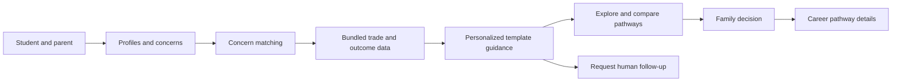
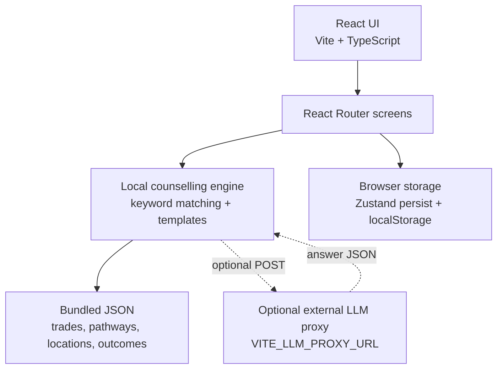

# CareerSarthi AI

### Guiding Families. Shaping Futures.

CareerSarthi AI is a family-centred career guidance prototype for vocational education. It helps learners and parents explore trade pathways, discuss practical concerns, compare available information, and request support from a human counsellor.

Career choices affect the whole family. By giving students and parents a place to consider their priorities together, the platform aims to make vocational options easier to understand and discuss.

> **Prototype notice:** This repository contains a front-end prototype. Its bundled career outcomes and provider records are labelled demonstration/pilot data, not independently verified results. It does not include a production backend, database, authentication service, or counselling team.

## 🎯 Problem

Vocational education can be perceived as lower-status than a conventional degree pathway, even when it may suit a learner's interests and circumstances. Parents often have a strong influence on education and career decisions, and naturally want to understand the risks and opportunities before supporting a choice.

Common family questions include:

- What might earnings and job prospects look like?
- Is the work safe, and how far away is training?
- What will training cost, and can the learner continue studying?
- How is the trade viewed by the family and community?

Many career tools focus mainly on the learner. This prototype focuses on the family conversation as well as the learner's interests.

## 💡 Solution

CareerSarthi AI brings learner and parent profiles, concern-led counselling, trade exploration, and human-support requests into one interface. It provides bilingual English and Hindi screens and uses the available profile and local data to tailor guidance.

The project currently provides **source-labelled illustrative information**, not independently verified career or placement outcomes. Most bundled outcome records are explicitly marked as demo data. Families should treat them as examples, not guarantees or current labour-market evidence.

Counselling replies are generated by a deterministic, keyword-based concern matcher and response templates. If an optional external proxy is configured, the app can send a question and its retrieved answer context to that proxy for a rewritten answer. There is no AI provider or proxy server included in this repository.

## ✨ Key Features

- **Concern-led counselling:** English, Hindi, and Hinglish keyword matching for topics such as earnings, security, social perception, safety, travel, cost, and further education.
- **Trade explorer:** Browse eight configured trade options, search and filter by sector, and view available local or state-level records.
- **Family profiles:** Save learner interests and education details, parent concerns and income bracket, and district selection.
- **Career comparisons:** Compare trades or locations using the records available in the prototype.
- **Earnings calculator:** Explore an illustrative calculation using editable assumptions and available data; it is not a promise of future earnings.
- **Pathway details:** View configured NSQF steps and pathway descriptions for trades with pathway data.
- **English and Hindi:** Switch the interface language and view bilingual content where translations are provided.
- **Human-support request:** Submit a callback request, receive a reference ID, and view its case status in the prototype.
- **Counsellor queue:** Review demo and locally created cases, claim and update cases, and reveal a phone number only after claiming a case.
- **Dashboard:** Review demo/session-derived metrics, concern summaries, district breakdowns, and charts.
- **Notifications and preferences:** See case updates and save display, language, and accessibility preferences in the browser.

> Outcome figures and demo cases are illustrative. A displayed source name and year do not make a demo record independently verified.

## 🔄 How It Works



The diagram describes the prototype's current flow. An optional LLM proxy can rewrite a grounded answer when configured; it does not replace the local data or add a server to this project.

## 🖥️ Platform Walkthrough

| Screen | Route | What it does |
|---|---|---|
| Home | `/` | Shows family setup progress, concern shortcuts, recommendations, and next steps. |
| Onboarding | `/language`, `/consent`, `/mode`, `/location` | Select language, review consent, choose a mode, and set location. |
| Family profiles | `/profile-learner`, `/profile-parent` | Record learner education/interests and parent concerns. |
| Family summary | `/summary`, `/family-summary` | Review the agreement/summary and the top match from the saved answers. |
| Counsel | `/chat` | Ask a concern-focused question, use suggested concerns, listen to a reply, and request human support. |
| Explore | `/explore` | Search and filter configured trades by sector and location. |
| Career details | `/trade/:tradeId` | View a trade's available outcomes, provider information, and pathway steps. |
| Compare and calculate | `/compare-trades`, `/compare-cities`, `/earnings-calculator` | Compare configured data or explore an illustrative earnings calculation. |
| Support request | `/escalation` | Request a callback and view the request's reference and status. |
| Settings | `/settings` | Adjust language, text size, simple mode, contrast, and audio preferences. |
| Sentiment and thank-you | `/sentiment-start`, `/sentiment-end`, `/thanks` | Record an optional start/end sentiment rating and show the post-session thank-you screen. |
| Counsellor queue | `/counsellor`, `/cases`, `/escalations` | Review and update cases in the staff-facing queue. These routes use the same queue screen. |
| Admin dashboard | `/dashboard`, `/reports` | View session and case analytics. These routes use the same dashboard screen. |

Staff routes are protected by a **demo-only client-side PIN gate**. This is not production authentication.

## 🏗️ System Architecture

The current implementation is a browser application. It has no application server or database layer; the included records are JSON files, while profile, settings, cases, sessions, and notification preferences are saved in browser storage.



The optional proxy is an integration point only. This repository does not implement, host, or secure that service.

## 🛠️ Technology Stack

| Layer | Technology | Purpose |
|---|---|---|
| Frontend | React 19, TypeScript, Vite | Client-rendered user interface and development/build tooling. |
| Routing | React Router | Family and staff screen routes. |
| Styling | CSS | Layout, responsive styling, themes, and design tokens. |
| Charts | Recharts | Dashboard visualizations. |
| Icons | lucide-react | Interface icons. |
| Client state | Zustand with persist middleware | Persist family profiles and settings in browser storage. |
| Data | Local JSON files | Trade, location, pathway, provider, concern, and outcome records. |
| Backend / database | Not included | The project has no application backend or server database. |
| AI / counselling | Local TypeScript templates; optional external proxy | Deterministic concern matching and replies; optional configured proxy for answer rewriting. |
| Authentication | Not included | The staff PIN gate is a local demo control, not authentication. |

## 🚀 Getting Started

### Requirements

- Node.js and npm
- Git

This repository does not include a database or backend service that needs to be started.

### Install and run

```bash
git clone https://github.com/Alpha-Aryan29/CareerSarthi-AI.git
cd CareerSarthi-AI
npm ci
npm run dev
```

Vite prints the local development URL in the terminal (normally `http://localhost:5173`).

### Environment variables

There is no `.env` or `.env.example` file in the repository. The only environment variable read by the frontend is:

| Variable | Required | Purpose |
|---|---:|---|
| `VITE_LLM_PROXY_URL` | No | URL of an externally hosted proxy that accepts a `POST` JSON body with `question`, `context`, `language`, and `instruction`, and returns JSON containing a string `answer`. |

Without this value, counselling uses the local response templates. The proxy itself is not included. Vite exposes `VITE_*` configuration to client-side code, so **do not put API keys or other secrets in this variable or in a frontend `.env` file**.

To build and serve the production bundle locally:

```bash
npm run build
npm run preview
```

## 📁 Project Structure

```text
.
├── public/                    # Favicon and static public assets
├── src/
│   ├── components/            # Shared layout, cards, chat, and UI components
│   ├── data/                  # Bundled JSON lookup, pathway, provider, and outcome data
│   ├── features/              # Screens grouped by product area
│   │   ├── conversation/      # Counselling UI and response engine
│   │   ├── counsellor/        # Staff case queue
│   │   ├── dashboard/         # Analytics dashboard
│   │   ├── escalation/        # Callback request flow
│   │   └── explore/           # Trade details, comparisons, and calculator
│   ├── hooks/                 # Language, family-session, and settings state
│   ├── lib/                   # Shared case/session storage and translations
│   ├── locales/               # English and Hindi translations
│   ├── types/                 # Shared TypeScript data types
│   ├── App.tsx                # Route definitions
│   └── main.tsx               # React entry point
├── index.html                 # HTML entry point and page metadata
├── package.json               # Scripts and dependencies
└── vite.config.ts             # Vite configuration
```

## 🔐 Security & Data

- **No server-side storage:** Profiles, preferences, demo sessions, and callback cases are kept in the user's browser. This is prototype storage, not a shared production case-management system.
- **Personal information:** Callback requests can include a name and phone number. Do not enter real or sensitive personal information into a public/demo deployment.
- **Authentication:** There is no user authentication or server-side authorization. The staff PIN gate is client-side and must not be treated as access control.
- **API configuration:** No API key is bundled. The optional proxy URL is public frontend configuration; credentials, if needed by a proxy, must be handled by that separately deployed server.
- **Input validation:** The callback form checks the phone number against a 10-digit Indian mobile-number pattern before creating a local case. This is client-side validation, not server-side verification.
- **Outcome data:** Treat bundled demo/pilot figures as illustrative. They are not evidence of current placement or earnings and are not independently verified by the application.

## 📊 Intended Impact

CareerSarthi AI is intended to help families:

- Make more informed vocational career decisions together.
- Discuss parental concerns with clearer, structured information.
- Understand training and progression pathways.
- Compare the career information available for different trades and locations.
- Reach human support when automated guidance is not enough.

This project does not report measured user outcomes or impact statistics.

## 🧪 Testing

The repository does not define a unit- or integration-test script, and no test files are included. Available verification commands are:

```bash
npm run build   # TypeScript project build followed by Vite production build
npm run lint    # Oxlint
```

## 🔮 Future Scope

The following are possible future improvements; they are **not implemented as production capabilities** in this repository:

- Add more Indian regional languages and broader speech-based conversation support.
- Replace illustrative records with expanded, current datasets whose sources and methodology can be independently checked.
- Add a secure backend, database, and authenticated family/counsellor accounts.
- Integrate WhatsApp for consent-based family follow-up.
- Expand geographic analytics and improve the counsellor case-management workflow.
- Evaluate counselling quality and accessibility with families and counsellors.

## 🤝 Contribution

Contributions are welcome. A practical workflow:

1. Open an issue describing the problem or proposed change.
2. Create a focused branch and make a small, tested change.
3. Run `npm run build` and `npm run lint`.
4. Open a pull request with a concise summary and relevant screenshots for visual changes.

Keep data provenance explicit, preserve the prototype's privacy limitations, and do not present demo outcomes as verified evidence.

## 📄 License

No license file is present in this repository. Unless and until a license is added, the project's reuse and redistribution terms are **not specified**.

---

CareerSarthi AI is designed around one simple belief:

> Career decisions should not be made by students alone. They should be informed by students, families, evidence, and trusted guidance.

### Guiding Families. Shaping Futures.
